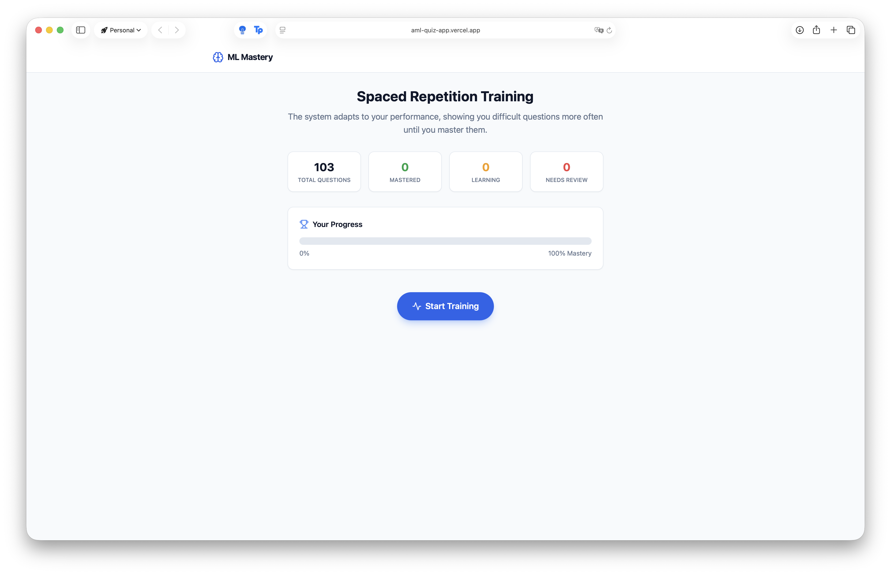

# AML Spaced Repetition Quiz

A React-based web application designed to help students master Advanced Machine Learning concepts using **Spaced Repetition**.

🚀 **Live Demo:** [https://aml-quiz-app.vercel.app](https://aml-quiz-app.vercel.app)



The application uses a weighted algorithm to prioritize questions you struggle with, ensuring efficient study sessions by showing difficult concepts more frequently than mastered ones.

## Features

- 🧠 **Spaced Repetition System (SRS)**: Automatically adjusts the frequency of questions based on your performance streak.
- 📊 **Progress Dashboard**: Visual tracking of your mastery level (Mastered, Learning, Needs Review).
- 💾 **Local Persistence**: Your progress is automatically saved to your browser's local storage.
- 🚩 **Error Reporting**: Integrated system to report issues with questions or answers directly to the maintainer via GitHub Issues or Email.
- 📱 **Responsive Design**: Optimized for both desktop and mobile study sessions.

## Tech Stack

- **Framework**: React + TypeScript
- **Build Tool**: Vite
- **Styling**: Tailwind CSS
- **Icons**: Lucide React

## Development

To run this project locally:

1. Install dependencies:
   ```bash
   npm install
   ```

2. Start the development server:
   ```bash
   npm run dev
   ```

## Credits

**Built with Google AI Studio.**
